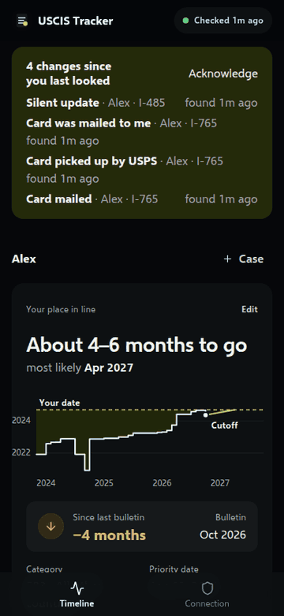
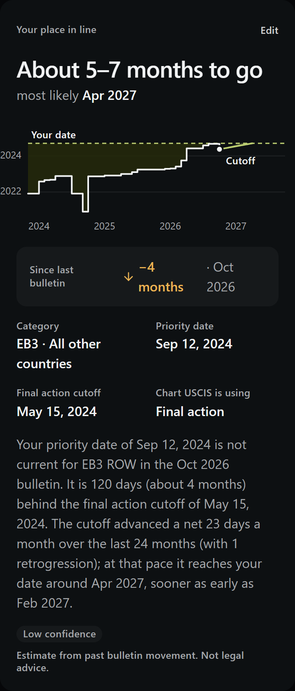
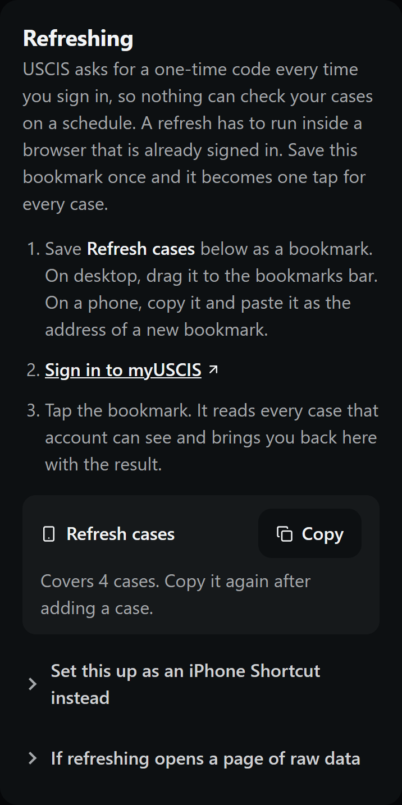

# USCIS Tracker

**Know what moved on your green card case, and when your date comes up.** One tap from a
signed-in USCIS tab reads every case in your household. The tracker keeps the full
history, tells you what changed since you last looked (including the silent updates
USCIS never announces), and estimates when the visa bulletin will reach your priority date.

<p align="center">
  
</p>

- **One tap refreshes everything.** A saved bookmark reads every case from a signed-in
  myUSCIS tab and brings you back with the result. No passwords stored, nothing scraped
  on a schedule.
- **"What changed?" first.** The top of the screen lists everything new since your last
  visit, across every person and case, until you acknowledge it.
- **Silent updates are caught.** When USCIS touches a case without changing its status,
  the tracker still notices, because it diffs every snapshot against the last.
- **Your place in line.** Enter your category, country and priority date, and it reads the
  monthly visa bulletin to say how far behind the cutoff you are and when, at the recent
  pace, you're likely to be current.
- **A readable timeline.** Internal codes like `FTA0` and `IMAG` become "Actively
  reviewing" and "Biometrics scheduled", with a plain explanation of each.
- **Built for a household.** Each person keeps their own cases and myUSCIS account; a
  spouse can inherit the principal's category and priority date.
- **Push notifications** on real movement, so whoever didn't run the refresh finds out too.
- **Self-hosted.** Receipt numbers and case data never leave your server.

<p align="center">
  
  
</p>

## How to use it

1. **Add the people and their receipt numbers.** Each person is one myUSCIS account.
2. **Save the refresh bookmark.** On the Connection screen, copy *Refresh cases* into a
   bookmark (or an iPhone Shortcut).
3. **Sign in to myUSCIS and tap it.** You land back on the tracker with every change
   marked. Do it whenever you'd have checked USCIS anyway.

## Why This Exists

My wife and I were tracking our own immigration cases, and the only real option was to log
into USCIS, open hidden API pages, copy JSON, and try to notice what changed since last
time. Then, separately, read the visa bulletin every month and do date arithmetic by hand.

This app removes the comparison work. It keeps every snapshot, derives what changed, and
tells both of us when something actually moves. What it doesn't do is pretend to check
unattended: USCIS asks for a one-time code on every sign-in, so any tracker that claims
to poll in the background either stores your session or quietly stops working. The research
behind that is in [docs/acquisition-research.md](docs/acquisition-research.md).

Visa bulletin history comes from [visa-bulletin-data](https://github.com/armanckeser/visa-bulletin-data),
a public dataset of every bulletin since FY2016 that this project maintains alongside.

---

## Self-Hosting

You need Docker, and the tracker must be reachable from the phone you refresh on (a home
server plus Tailscale works well).

```bash
git clone https://github.com/armanckeser/uscis-tracker && cd uscis-tracker
cp server/.env.example server/.env    # set APP_ORIGIN to the address you'll open it at
docker compose -f docker-compose.prod.yml up -d --build
```

The app is served on port `5181`. Put it behind HTTPS: the refresh bookmark posts from
`my.uscis.gov`, and browsers only allow that to a secure origin.

**Push notifications:** run `npx web-push generate-vapid-keys` and put both keys in
`server/.env`. Regenerating them later breaks existing subscriptions.

**Try it with demo data:** with the stack running, `node scripts/seed-demo.mjs http://localhost:4000`
adds a fictional household (the one in the screenshots).

| Variable | Default | |
| --- | --- | --- |
| `APP_ORIGIN` | | The address you open the tracker at. The API refuses calls from anywhere else. |
| `DATABASE_URL` | local Postgres | |
| `VAPID_PUBLIC_KEY`, `VAPID_PRIVATE_KEY` | | Enable push notifications. |
| `BULLETIN_SYNC` | `true` | Pull new visa bulletins every 6 hours. |
| `VISA_BULLETIN_BASE_URL` | the public dataset | A URL or local directory with the bulletin files. |
| `APPLY_SCHEMA` | `true` | Apply `schema.sql` on startup. |

## Development

```bash
npm install
cp server/.env.example server/.env
docker compose up -d postgres
npm run dev          # frontend on :5173, API on :4000
npm test             # vitest, no database needed
npm run build
```

- **Frontend:** React 19 PWA with Vite and Base UI. Two views, Timeline and Connection.
- **Backend:** Hono on Node. Stores every snapshot in Postgres, diffs it against the last,
  and sends Web Push on meaningful movement. It holds no USCIS credentials.
- **Shared:** `shared/` holds the timeline, stage and prediction logic used by both sides.

[DOMAIN.md](DOMAIN.md) maps what the USCIS API actually returns and what each field means.

## License

Released under the GNU Affero General Public License v3.0, see [LICENSE](LICENSE). If you run a modified version where other people can reach it, the AGPL asks you to publish your changes too.
